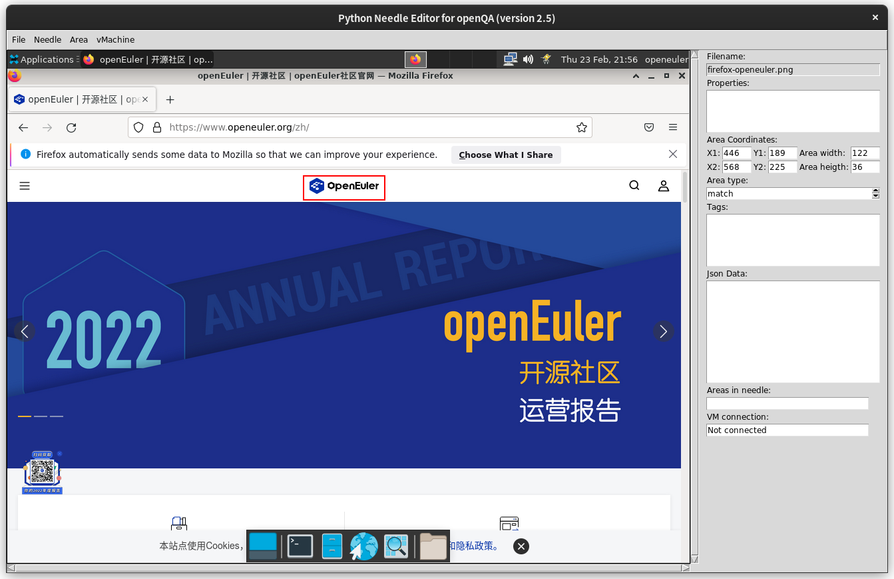
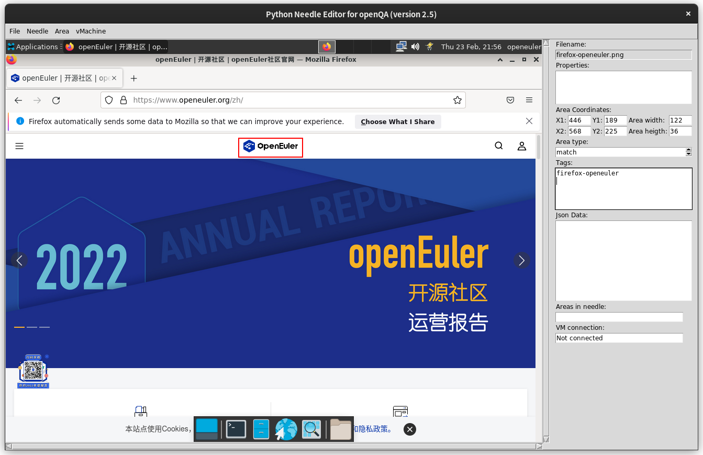
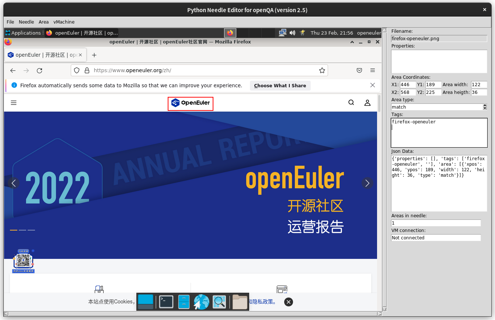

# oE-RISC-V-OpenQA简单测试用例开发  
## 简单Firefox测试用例的开发  
- 本文档记录一个简单的Firefox OpenQA测试用例（测试Firefox启动，打开新标签页并访问指定网站）的开发和使用。前置条件为完成oE-RISC-V-OpenQA的部署  
## OpenQA/os-autoinst API  
### 创建needles  
- needles为OpenQA进行图像匹配的基本元素，下文介绍针对Firefox测试用例的needles创建方法  
- 此处介绍的方法基本思想为在QEMU中截图+needly建立JSON描述文件  
#### oE QEMU xfce虚拟机配置和截屏  
- 如果要让SDL窗口的分辨率匹配OpenQA默认的分辨率，可以在启动脚本```-device virtio-vga```一行加上```,xres=1024,yres=768 ```参数  
    即：
    ```
    -device virtio-vga,xres=1024,yres=768 
    ```
- 本例中的测试用例需要用到assert_and_click assert_screen type_string send_key四个api，需要的截图分为点击点匹配和屏幕匹配两种，前者用于匹配鼠标操作（和后续的键盘操作）的位置，后者作为测试的检查点  
- 需要注意的是，qemu虚拟机和最终openqa中镜像的行为不一定会完全相同，或者在前期创建needle时有误。这种情况下可以使用openqa webui中的needle editor进行微调和新needle的创建  
- 例如测试Firefox启动和打开网页可分为以下步骤：
    - 鼠标点击浏览器图标  
        assert_and_click 匹配到桌面上的浏览器图标后，openQA会模拟鼠标左键单击行为    click point
    - 等待Firefox打开  
        assert_screen 匹配图形，如Firefox左上角的logo  
    - 等待Firefox启动完成  
        assert_screen   
    - 点击新建标签页  
        assert_and_click 匹配加号并点击  
    - 等待新标签页打开  
        assert_screen   
    - 匹配并点击地址栏  
        assert_and_click   
    - 输入地址并回车  
        type_string  
    - 等待网页加载完成  
        assert_screen  
#### needly needles创建工具使用  
- needly是fedora开发的一个openqa needles创建工具，可使用flatpak安装  
- 打开截图  
    软件左上角File->Open file或Open directory(打开目录后可使用File->Load next或Load previous切换)  
      
- 绘制选取  
    直接在截图显示区域拖动鼠标框选  
      
- 添加标签  
    在右侧Tags栏中添加needle的tag  
      
- 添加选区  
    框选完后需要点击Area->Add area使新增选区生效  
      
- 保存needle配置文件  
    点击Needle->Save或使用Crtl+S保存needle的json配置文件，文件会自动以截图相同的文件名（拓展名为.json）保存在同一目录  
- 保存的needle配置文件如下：
    ```json
    {
    "properties": [],
    "tags": [
        "firefox-openeuler",
        ""
    ],
    "area": [
        {
        "xpos": 446,
        "ypos": 189,
        "width": 122,
        "height": 36,
        "type": "match"
        }
    ]
    }
    ```
#### needles部署  
- 将创建好的needles（截图和JSON配置文件）放至/var/lib/openqa/tests/openeuler/products/openeuler/needles/中即可  
### 创建测试用例  
- 在/var/lib/openqa/tests/openeuler/tests目录下新建perl模块，在run函数中按照此前描述的Firefox测试步骤编写
### 创建测试套  
- 编写对应的测试套schedule文件，存入对应目录，之后在webui中创建测试套即可  
