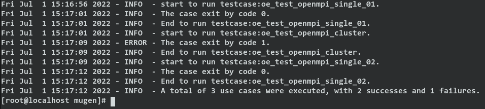
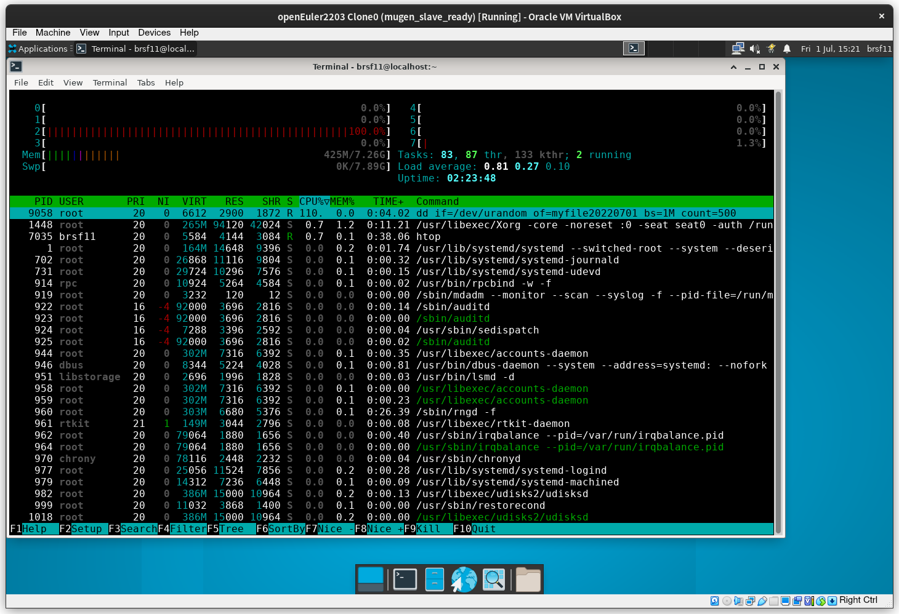
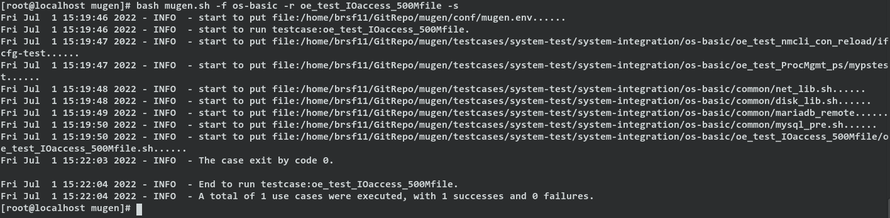
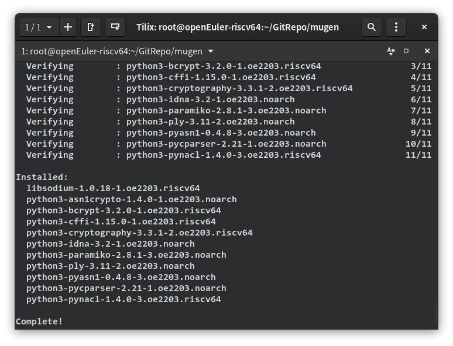
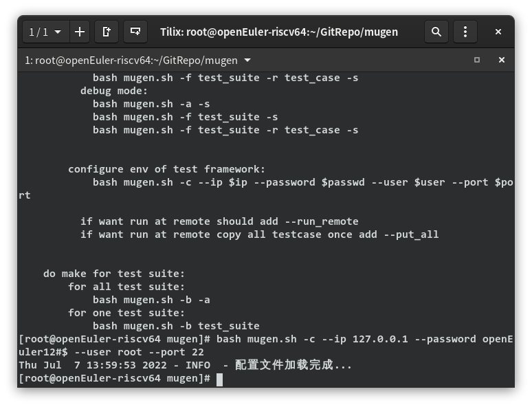
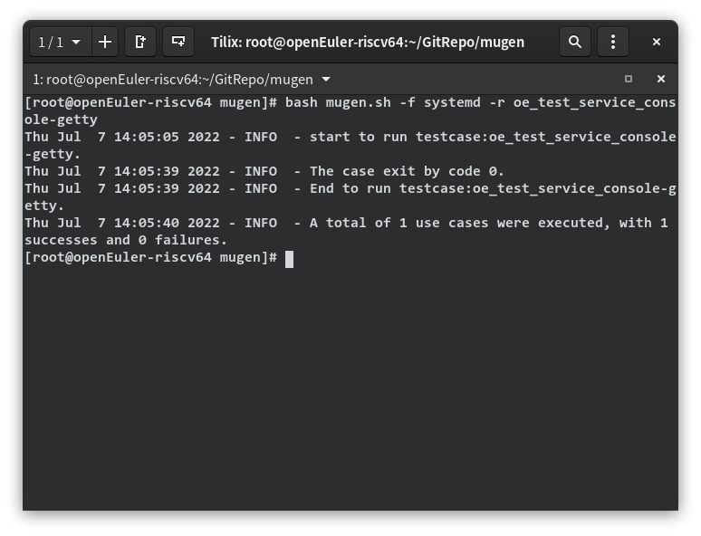

# 2022-07-08 openEuler RISC-V mugen测试框架移植情况  
## 已完成的工作
### openEuler x86_64 环境下mugen框架运行成功
- 运行环境  
  

- 初步运行结果
  - x86_64 openEuler 本地测试  
    能够运行测试，但很多测试结果不正确，是测试框架运行环境的问题还是系统本身存在功能问题有待验证  
      
  - x86_64 openEuler 远程测试  
    能够运行一部分测试，很多测试因为运行环境问题无法正确运行  
    正确运行情况：  
      
        
    无法正确运行的情况：  
       
    ```
    oe_test_socket_git.sh: line 20: ../common/common_lib.sh: No such file or directory
    oe_test_socket_git.sh: line 45: main: command not found
    ```  
### openEuler RISC-V 环境下mugen框架运行成功
- 运行环境  
    - openEuler RISC-V QEMU虚拟机  
    - 2022-06-22 QEMU测试镜像 v0.2   
- 初步运行结果  
    - RISC-V openEuler 本地测试  
    - 安装依赖  
      
    - 配置节点  
      
    - 运行测试用例  
      
### mugen辅助脚本
- 测试需求
    - openEuler RISC-V 发布需要测试系统镜像和源的基本可用性，mugen测试框架可以辅助这一过程。  
    - 目前mugen支持指定测试集运行测试，但一个镜像的基本可用性测试会涉及到多个测试集，故可以开发一套程序来实现输入测试列表、自动匹配测试集/反馈测试集缺失并在测试完成后收集错误信息等功能
- mugen辅助脚本目前已完成的功能  
    - 1.接收测试列表文件，匹配测试集，并报告缺失的测试集名称和可运行的测试集数量    

    - 2.根据可运行的测试列表，自动调用mugen运行测试  
    - 3.测试运行完成后，报告每一个测试对象的测试通过情况，整理出错的测试对应的日志文件到logs_failed/下  
## 待解决的问题
- openEuler RISC-V 的测试环境还需进一步配置  
- mugen辅助脚本程序的可靠性有待进一步提升  
- 系统镜像发布软件包列表和测试列表并不能很好得对应  
- 有一些测试用例缺失  