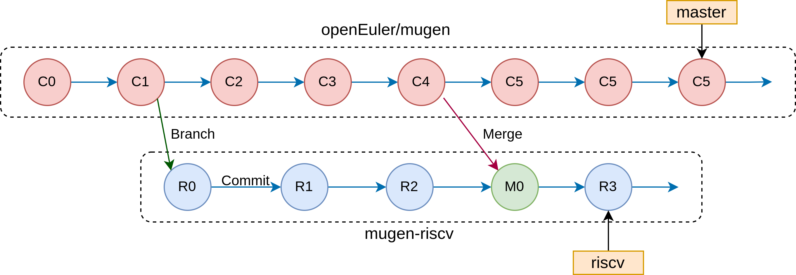

# RISC-V mugen 组织形式探讨  
## 需求  
- 需要一个合理的形式来组织RISC-V mugen对mugen原来测试例和测试套的增改以及增添的脚本，以达成较好的可用性和可维护性  
- mugen在不断更新，组织形式也要考虑到对未来mugen更新内容的兼容性和可利用性  
- mugen的更新内容大概可分为以下三类  
    - mugen框架的更新  
    - 无关RISC-V mugen的测试套/测试例增改（不用考虑合并冲突）  
    - 与RISC-V有关的测试套/测试例增改（需要考虑合并冲突和更新后在RISC-V oE上的可用性）  
## 可行的方式  
- 以补丁形式维护  
- 基于git，维护一个平行于mugen/master的分支  
- ...  
## 以补丁形式维护  
- 基本想法  
    - RISC-V mugen主要需要修改测试套和测试例文件  
    - 可以避免直接改变mugen中的代码，通过维护一套补丁，在运行测试前应用补丁，测试结束后可回退   
## 维护平行分支  
- 基本想法  
    - 利用git的分支  
    - 测试套和测试例的改写以及脚本更新等工作在riscv分支上完成  
    - mugen/master更新merge到riscv分支  
    - riscv分支使用单独的仓库  
    - 如下图所示  
          
- 演示  
    - 托管仓库
        - openEuler/mugen  
        - mugen-riscv  
    - 本地仓库  
        - 只贡献给riscv分支   
        - 合并mugen/master   
    - riscv分支  
        - 工具更新  
        - 测试套整理  
        - 测试例改写  
        - 新测试编写  
    - mugen/master合并  
        - 无关RISC-V mugen的测试套/测试例增改（不用考虑合并冲突）  
        - mugen框架的更新（需要测试可用性）  
        - 与RISC-V有关的测试套/测试例增改（需要考虑合并冲突和更新后在RISC-V oE上的可用性）  
- pros & cons  