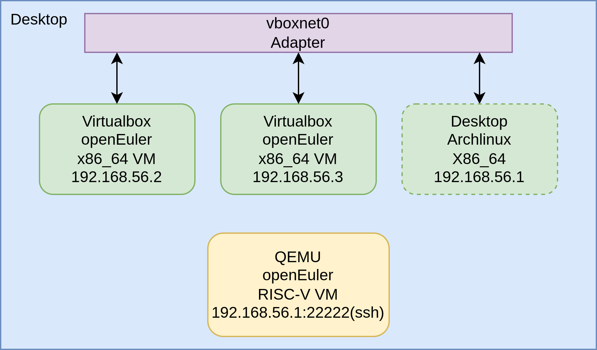

# 第二周工作总结

## 本周工作内容
### 配置mugen测试框架运行环境
- mugen是openEuler社区开放的测试框架，它提供了一套测试脚本、运行测试脚本的框架和编写测试脚本的模板，使用它可以方便地在本地或远程执行指定的一套或者一个测试。
- 基本用法：  
  - 安装依赖
    ```shell
    sudo bash dep_install.sh
    ```
  - 配置节点：
    ```shell
    bash mugen.sh -c --ip $ip --password $passwd --user $user --port $port
    ```
  - 运行测试：
    ```shell
    bash mugen.sh -a
    bash mugen.sh -f testsuite
    bash mugen.sh -f testsuite -r testcase
    bash mugen.sh -f testsuite -s
    ```
- 运行环境  


