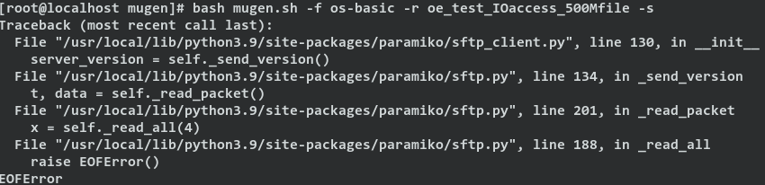

# 第二周工作总结

## 本周工作内容
### 配置mugen测试框架运行环境
- mugen是openEuler社区开放的测试框架，它提供了一套测试脚本、运行测试脚本的框架和编写测试脚本的模板，使用它可以方便地在本地或远程执行指定的一套或者一个测试。
- 基本用法：  
  - 安装依赖
    ```shell
    sudo bash dep_install.sh
    ```
  - 配置节点：
    ```shell
    bash mugen.sh -c --ip $ip --password $passwd --user $user --port $port
    ```
  - 运行测试：
    ```shell
    bash mugen.sh -a
    bash mugen.sh -f testsuite
    bash mugen.sh -f testsuite -r testcase
    bash mugen.sh -f testsuite -s
    ```
- 运行环境  


- 初步运行结果
  - x86_64 openEuler 本地测试  
    能够运行测试，但很多测试结果不正确，是测试框架运行环境的问题还是系统本身存在功能问题有待验证  
    
  - x86_64 openEuler 远程测试  
    能够运行一部分测试，很多测试因为运行环境问题无法正确运行  
    正确运行情况：
    
      
    无法正确运行的情况：  
     
    ```
    oe_test_socket_git.sh: line 20: ../common/common_lib.sh: No such file or directory
    oe_test_socket_git.sh: line 45: main: command not found
    ```
  - RISC-V openEuler 本地测试  
    目前mugen的依赖存在问题，无法在RISC-V openEuler上直接运行测试
  - RISC-V openEuler 远程测试  
    同样无法运行执行测试，怀疑是QEMU的user网络模式下只有一个映射的ssh端口，导致mugen进行sftp传输时发生问题  
    
