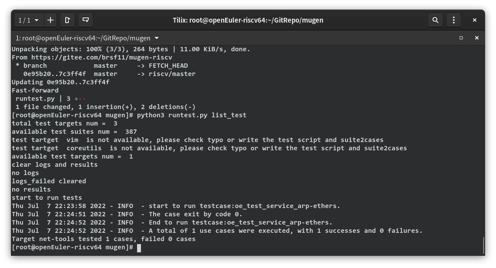

# 第三周工作总结

## 本周工作内容

### Firefox测试工作
- 完成了Firefox安装和查看的测试  

### openEuler RISC-V 上mugen的配置以及测试辅助脚本的编写  
- openEuler RISC-V 上mugen依赖安装  
    
- 配置mugen节点  
    
- 成功运行测试用例  
    
- 测试辅助脚本  
    - 使用python实现  
    - 输入测试清单文件，自动查找对应的测试用例集并运行，运行完后统计每个测试目标的测试情况，并整合出错的测试的日志文件
    
