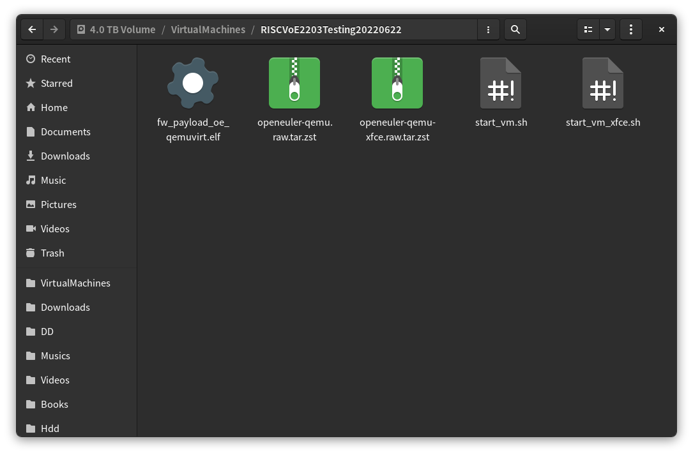
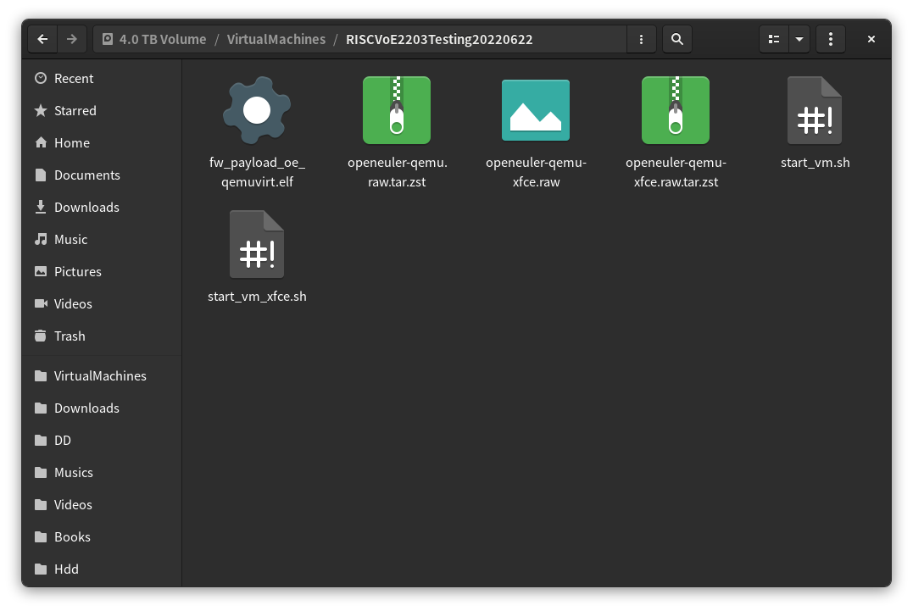
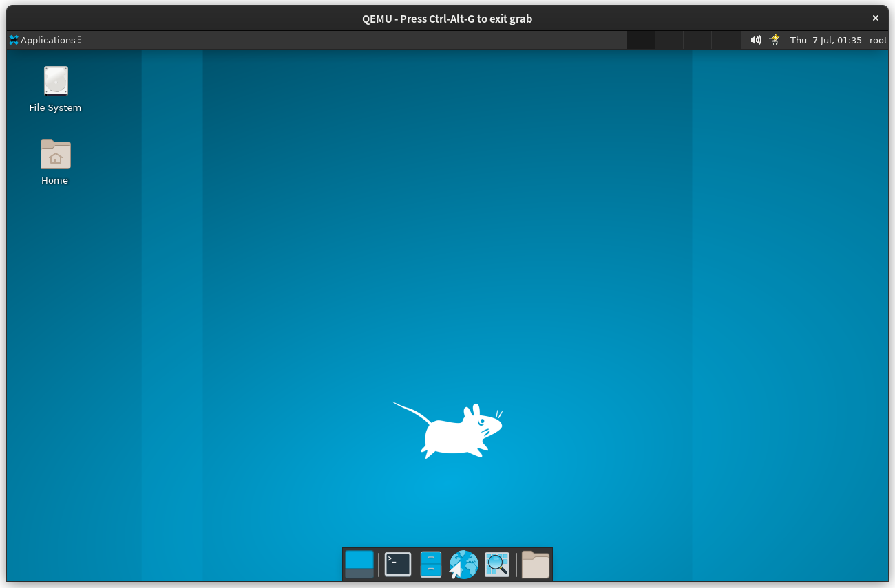
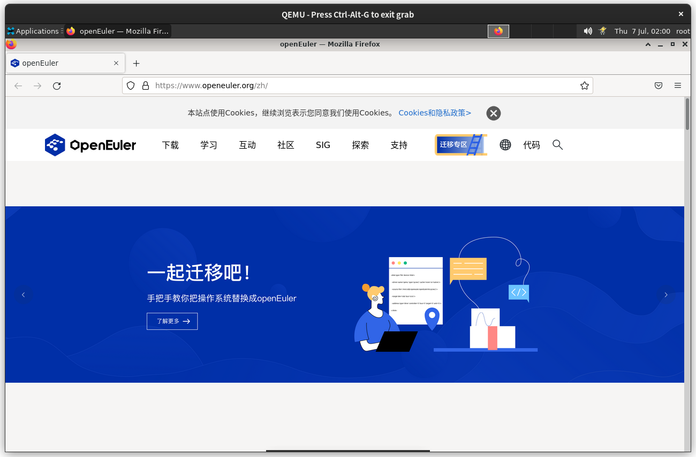

## 1.安装QEMU
- 1.1 Archlinux x86_64上直接通过pacman安装QEMU  
    ```shell
    sudo pacman -S qemu-system-riscv
    ```
    
- 1.2 运行输出版本号
    

## 2.系统镜像的使用
- 2.1 下载内容  
    从ISCAS镜像站中下载虚拟机
    ```shell
    aria2c https://mirror.iscas.ac.cn/openeuler-sig-riscv/openEuler-RISC-V/testing/20220622/v0.2/QEMU/fw_payload_oe_qemuvirt.elf
    aria2c https://mirror.iscas.ac.cn/openeuler-sig-riscv/openEuler-RISC-V/testing/20220622/v0.2/QEMU/openeuler-qemu-xfce.raw.tar.zst 
    aria2c https://mirror.iscas.ac.cn/openeuler-sig-riscv/openEuler-RISC-V/testing/20220622/v0.2/QEMU/openeuler-qemu.raw.tar.zst  
    aria2c https://mirror.iscas.ac.cn/openeuler-sig-riscv/openEuler-RISC-V/testing/20220622/v0.2/QEMU/start_vm.sh 
    aria2c https://mirror.iscas.ac.cn/openeuler-sig-riscv/openEuler-RISC-V/testing/20220622/v0.2/QEMU/start_vm_xfce.sh     
    ```
    如图
    
    
- 2.2 部署  
    解压镜像文件，直接右键openeuler-qemu-xfce.raw.tar.zst解压到此处
    
- 2.3 启动  
    在虚拟机目录下执行
    ```shell
    bash start_vm_xfce.sh
    ```
    
    视频输出启动，且成功进入xfce桌面环境，输入用户名密码后解锁
    

## 3.安装Firefox
- 3.1 安装  
    使用dnf直接安装Firefox
    ```shell
    dnf install firefox
    ```
- 3.2 启动  
    启动Firefox
    
    